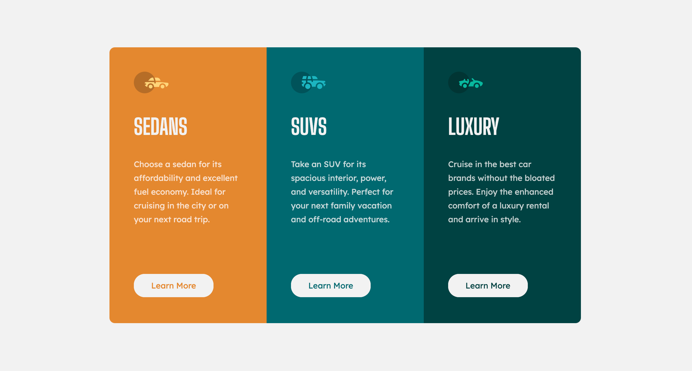

# Frontend Mentor - 3-column preview card component solution

This is my solution to the [3-column preview card component challenge on Frontend Mentor](https://www.frontendmentor.io/challenges/3column-preview-card-component-pH92eAR2-). 

## Table of contents

- [Overview](#overview)
  - [Screenshot](#screenshot)
  - [Links](#links)
- [My process](#my-process)
  - [Built with](#built-with)
  - [What I learned](#what-i-learned)
  - [Continued development](#continued-development)
- [Author](#author)

## Overview

### Screenshot

### Links

- Live Site URL: [3-Column Preview Card](https://cheytes.github.io/3-cloumn-preview-card/)

## My process

### Built with

- Semantic HTML5 markup
- CSS custom properties
- Flexbox
- Mobile-first workflow

### What I learned

I practiced what i had already known although i got to practice more with media queries.

### Continued development

I'd like to focus more on design and positioning. What's the best way to get the style and look i'm trying to achieve.

## Author

- Frontend Mentor - [@cheytes](https://www.frontendmentor.io/profile/cheytes)
- Twitter - [@chey_yte](https://twitter.com/chey_yte)

